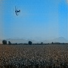
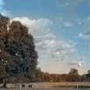
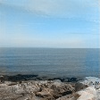
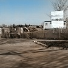
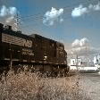
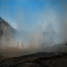
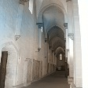
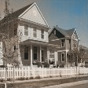
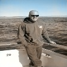
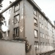

# Grayscale to Color using CNN
# Automatic Colorization of Grayscale images using Deep Learning

Developed a Convolutional Neural Network architecture to generate Color images from Grayscale input images.

Specifically, it generates color images in the YUV channels space when given input grayscale images in the Y channel.

Implemented a modified version of VGG-16 along with use of its Hypercolumns to concatenate with upscaling Hypercolumns (inspired from residual skip connections in ResNet) to generate UV channel output.

Trained and tested on cloud with Places dataset using Huber Loss function and Adam Optimizer.

One of the issue is that it sometimes produces sepia toned images. This is because of the simple loss function
## Dataset
Places dataset. [More details here](http://places.csail.mit.edu/)

# Results
Here are some of the best, average and worst results. Most of the results are sepia toned. However, obvious objects such as sky, farms etc. are being colored almost correctly. After further literature search, I found that using a complex cost function that takes into account more information can greatly achieve good results and produce much lesser sepia toned images.

## Some of the best generated colorized images

<== Original Image
<== Generated Image

<== Original Image
<== Generated Image

<== Original Image
<== Generated Image

## Some of the medium quality generated colorized images

<== Generated Image

<== Generated Image

<== Generated Image

<== Generated Image

## Some of the poor quality generated colorized images

<== Generated Image

<== Generated Image

<== Generated Image

<== Generated Image

<== Generated Image

# References

1) [Automatic Colorization](http://tinyclouds.org/colorize/)

2) [http://warmspringwinds.github.io/tensorflow/tf-slim/2016/11/22/upsampling-and-image-segmentation-with-tensorflow-and-tf-slim/](http://warmspringwinds.github.io/tensorflow/tf-slim/2016/11/22/upsampling-and-image-segmentation-with-tensorflow-and-tf-slim/) 

3) [Places dataset.](http://places.csail.mit.edu/)
	
## TODO
1. Implement a better and complex loss function
